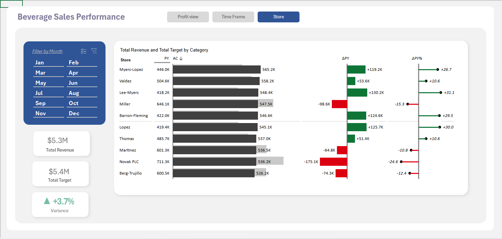
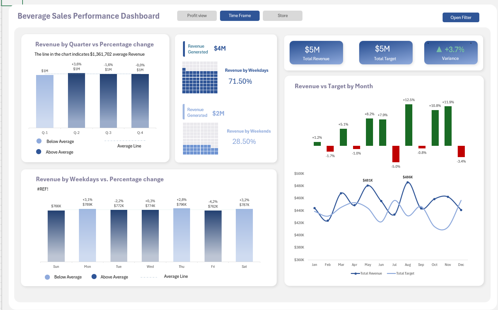
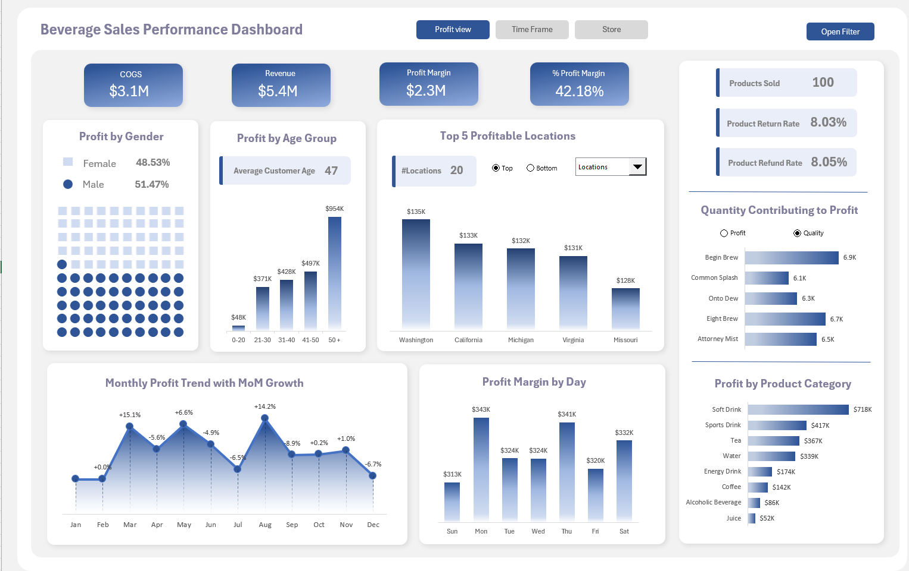
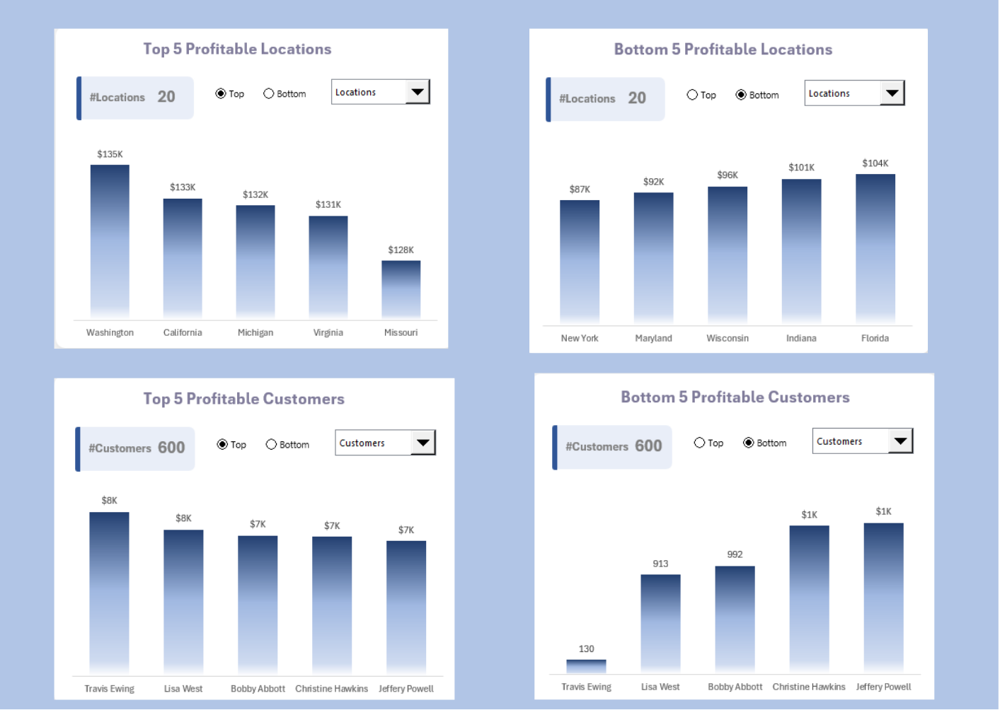

# Beverage Sales Performance Analytics Dashboard

A comprehensive data analytics project delivering actionable insights for FreshBrew Beverages to optimize sales performance, identify profitable opportunities, and drive strategic decision-making across 10 retail locations.

   

---

## Live Demo

**Watch the dashboard in action**

[Excel_Sales_Report.webm](https://github.com/user-attachments/assets/2240e903-a1a8-4345-8a8e-801d79b77ee1)

### Dashboard Screenshots:

<table>
  <tr>
    <td align="center">
       
      <b>Store Performance Overview</b> 
      Revenue vs Target tracking with variance analysis
    </td>
    <td align="center">
       
      <b>Time Frame Analysis</b> 
      Quarterly trends and weekday/weekend patterns
    </td>
  </tr>
  <tr>
    <td align="center">
       
      <b>Profit Analysis Dashboard</b> 
      Demographics, products, and location profitability
    </td>
    <td align="center">
       
      <b>Location & Customer Analysis</b> 
      Top vs Bottom performers comparison
    </td>
  </tr>
</table>

---

## Table of Contents

- [Live Demo](#live-demo)
- [Client Background](#client-background)
- [Executive Summary](#executive-summary)
  - [Questions Answered](#questions-answered)
  - [Findings at a Glance](#findings-at-a-glance)
  - [Business Impact](#business-impact)
- [Dashboard Analysis](#dashboard-analysis)
  - [Figure 1: Store Performance Overview](#figure-1-store-performance-overview)
  - [Figure 2: Time Frame Analysis](#figure-2-time-frame-analysis)
  - [Figure 3: Profit Analysis Dashboard](#figure-3-profit-analysis-dashboard)
  - [Figure 4: Location & Customer Profitability](#figure-4-location--customer-profitability)
- [Key Findings](#key-findings)
- [Business Recommendations](#business-recommendations)
- [Methodology](#methodology)
- [Skills & Tools](#skills--tools)
- [Next Steps](#next-steps)
- [Lessons Learned](#lessons-learned)

---

## Client Background

**Company**: FreshBrew Beverages Inc.

**Industry**: Beverage Retail & Distribution

**Challenge**: FreshBrew Beverages is a rapidly expanding beverage retailer operating 10 stores across major metropolitan areas. With over 20,000 transactions annually and a diverse product portfolio of 100 beverages spanning soft drinks, energy drinks, tea, water, coffee, alcoholic beverages, and juice, the company faced significant challenges in understanding performance variations across locations, identifying underperforming stores, and optimizing inventory management. The leadership team struggled with fragmented data sources and lacked visibility into real-time profitability metrics, customer behavior patterns, and product performance across different demographics and time periods.

**Objective**: Develop an interactive, multi-dimensional analytics dashboard to provide executive leadership with clear insights into store performance against targets, profitability trends, customer demographics, product category performance, and actionable recommendations for revenue growth and operational efficiency.

---

## Executive Summary

### Questions Answered

1. **Which stores are meeting or exceeding their monthly targets?**
2. **What are the profitability trends by time period (quarterly, monthly, daily)?**
3. **Which customer demographics contribute most to profit margins?**
4. **What products drive the highest profit margins and volumes?**
5. **Which locations and customers represent our top and bottom performers?**
6. **How does revenue vary between weekdays and weekends?**
7. **What is our product return and refund impact on overall profitability?**

### Findings at a Glance

| Metric | Value | Insight |
|--------|-------|---------|
| **Total Revenue** | $5.3M | Slightly below target but showing positive variance |
| **Total Target** | $5.4M | 98% achievement rate |
| **Overall Variance** | +3.7% | Positive growth trajectory |
| **Profit Margin** | 42.18% | Healthy margin indicating efficient operations |
| **COGS** | $3.1M | Well-controlled cost structure |
| **Products Sold** | 100 | Full portfolio activation |
| **Return/Refund Rate** | ~8% | Moderate concern requiring attention |
| **Top Performing Store** | Myers-Lopez | +26.7% above target |
| **Weekday Revenue Contribution** | 71.50% | Strong workweek performance |

### Business Impact

**Revenue Optimization**: Identified $175K-$98K variance gaps in underperforming stores, representing **$277K potential recovery opportunity**

**Profitability Enhancement**: 42.18% profit margin with **$2.3M total profit** demonstrates strong business model viability

**Customer Insights**: Male customers contribute **51.47% of profits** while the **50+ age group generates $854K**, indicating clear targeting opportunities

**Geographic Strategy**: Washington state generates **$135K profit** (top location), while bottom 5 locations collectively underperform by **$470K**

**Product Portfolio**: Soft Drinks category leads with **$718K profit**, suggesting potential for category expansion

**Operational Efficiency**: 71.50% weekday revenue concentration enables optimized staffing and inventory management

---

## Dashboard Analysis

### Figure 1: Store Performance Overview

**Purpose**: Store-level performance tracking against monthly targets with variance analysis

**Key Visualizations**:
- Monthly filter panel (Jan-Dec)
- Store comparison bar charts showing PY (Prior Year), AC (Actual), and ΔPY metrics
- KPI cards displaying Total Revenue ($5.3M), Total Target ($5.4M), and Variance (+3.7%)

**Analysis**:

The store performance dashboard reveals significant variation in performance across the 10 retail locations. **Myers-Lopez** emerges as the top performer with $446K revenue against a $565K target, achieving a **+26.7% variance** from prior year. This represents exceptional growth and suggests successful local market strategies or superior management practices. Similarly, **Valdez** ($504.6K revenue) and **Lopez** ($419.4K revenue) demonstrate strong positive variances of **+10.6%** and **+30.0%** respectively.

Conversely, three stores show concerning negative performance: **Miller** posts a **-15.3% variance** with $646.1K revenue against a $547.5K target, indicating potential market saturation or operational challenges. **Martinez** (-10.8% variance) and **Novak PLC** (-24.6% variance) similarly underperform, collectively representing significant revenue leakage. **Berg-Trujillo** shows the smallest negative variance at -12.4% but still requires attention.

The aggregate **+3.7% overall variance** masks these individual store struggles. While the portfolio shows net positive growth, the distribution is uneven, suggesting the need for targeted interventions at underperforming locations while documenting and replicating success factors from top performers.

---

### Figure 2: Time Frame Analysis

**Purpose**: Temporal performance analysis across quarters, months, and weekday/weekend splits

**Key Visualizations**:
- Quarterly revenue comparison with percentage change indicators
- Weekday vs. Weekend revenue split (71.50% / 28.50%)
- Monthly revenue vs. target bar chart with variance percentages
- Revenue trend line showing monthly fluctuations

**Analysis**:

The temporal analysis reveals distinct **seasonal and weekly patterns** critical for operational planning. Revenue distribution shows a pronounced **weekday preference with 71.50% of revenue ($4M)** occurring Monday through Friday, compared to just **28.50% on weekends ($2M)**. This suggests a primarily commuter or workplace-driven customer base rather than leisure shopping behavior.

Quarterly performance demonstrates interesting volatility: **Q1** generates $1M with +3.6% growth, **Q2** shows $1M at -1.6% decline, **Q3** recovers to $1M at -0.0% (flat), and **Q4** maintains $1M at -0.0%. This pattern suggests strong annual consistency but highlights mid-year softness requiring investigation—potentially related to summer vacation patterns or competitive pressures.

Monthly analysis uncovers significant performance swings. **July shows exceptional +12.5% variance**, the highest monthly performance, possibly driven by summer beverage demand or promotional activities. **August maintains momentum at +12.5%**, while **September through November** sustain positive variance (+10.8% to +11.9%). However, **February (-1.7%)**, **April (-1.0%)**, **September (-0.8%)**, and **December (-3.4%)** show declines, with December's drop particularly notable given typical holiday retail strength.

The revenue trend line displays regular fluctuation between $420K-$486K monthly, with August ($486K) and April ($481K) representing peak months, while February ($423K) marks the annual low point. This **$63K monthly swing** necessitates flexible inventory and staffing strategies.

---

### Figure 3: Profit Analysis Dashboard

**Purpose**: Comprehensive profitability assessment across customer demographics, products, and time periods

**Key Visualizations**:
- Financial KPIs: COGS, Revenue, Profit Margin, % Profit Margin
- Operational metrics: Products Sold, Return Rate, Refund Rate
- Gender-based profit contribution with visual split
- Age group profit analysis (0-20, 21-30, 31-40, 41-50, 50+)
- Top 5 Profitable Locations bar chart
- Quantity contributing to profit by product
- Monthly profit trend with MoM growth percentages
- Profit margin by day of week
- Profit by product category

**Analysis**:

The profit dashboard provides the most comprehensive view of business health. With **$5.4M revenue** against **$3.1M COGS**, the company achieves a **$2.3M profit margin (42.18%)**, demonstrating robust pricing power and operational efficiency. However, the **8.03% product return rate** and **8.05% refund rate** represent notable friction points, likely eroding profitability by approximately **$430K-$435K annually** and requiring quality control or customer experience improvements.

**Demographic analysis** reveals that **male customers contribute 51.47% of profits** compared to 48.53% from female customers—a relatively balanced split suggesting broad market appeal. The age group breakdown provides more actionable insights: the **50+ segment generates $854K** (highest), followed by **41-50 at $497K**, **21-30 at $428K**, **31-40 at $487K**, and **0-20 at $371K** (lowest). The **50+ dominance suggests premium product preferences** and higher spending capacity, while the younger demographic's lower contribution may indicate affordability barriers or brand preference misalignment.

**Geographic profitability** shows stark contrasts: **Washington leads with $135K profit**, followed by **California ($133K)**, **Michigan ($132K)**, **Virginia ($131K)**, and **Missouri ($128K)**. These top 5 locations collectively represent the business core, generating approximately **$659K profit**. Location-specific strategies clearly drive performance differentiation.

**Product quantity analysis** highlights **Begin Brew (6.9K units)**, **Eight Brew (6.7K units)**, and **Onto Dew (6.3K units)** as volume leaders, while **Common Splash (6.1K)** and **Attorney Mist (6.5K)** round out the top sellers. The relatively tight clustering (6.1K-6.9K range) suggests a well-balanced product portfolio without excessive dependency on single SKUs.

**Product category profitability** reveals significant disparities: **Soft Drink dominates with $718K profit**, followed by **Sports Drink ($417K)**, **Tea ($367K)**, **Water ($339K)**, **Energy Drink ($174K)**, **Coffee ($142K)**, **Alcoholic Beverage ($86K)**, and **Juice ($52K)**. The **Soft Drink category's commanding lead (3.5x higher than second-place Sports Drink)** indicates strong market fit and potential expansion opportunity, while Juice's poor performance ($52K) questions its portfolio inclusion.

**Monthly profit trends** demonstrate volatility: **March shows exceptional +15.1% MoM growth**, while **April peaks at +6.6%**, **August achieves +14.2%**, and **May posts +1.0%**. However, **February (-5.6%)**, **June (-4.9%)**, **July (-6.5%)**, and **December (-6.7%)** experience significant declines. The **August spike** warrants investigation for replicable success factors, while December's drop contradicts typical holiday performance expectations.

**Daily profit margin analysis** reveals **Monday ($343K) and Thursday ($341K)** as peak days, with **Tuesday and Wednesday** maintaining strong performance at **$324K each**. **Friday generates $320K**, while **Saturday ($332K)** outperforms **Sunday ($313K)**, the lowest-performing day. This pattern reinforces the weekday-dominant business model and suggests **Sunday operations may be marginally profitable or require optimization**.

---

### Figure 4: Location & Customer Profitability

**Purpose**: Comparative analysis of top vs. bottom performing locations and customers

**Key Visualizations**:
- Top 5 Profitable Locations vs. Bottom 5 Profitable Locations
- Top 5 Profitable Customers vs. Bottom 5 Profitable Customers
- Interactive toggle between "Top" and "Bottom" views
- Total count indicators (20 locations, 600 customers)

**Analysis**:

This comparative dashboard provides critical strategic intelligence for resource allocation and customer relationship management. 

**Location Performance Extremes**: The gap between **top performer Washington ($135K profit)** and **bottom performer New York ($87K profit)** represents a **$48K differential**, a 55% performance gap. The bottom 5 locations—**New York, Maryland, Wisconsin, Indiana, Florida**—collectively generate **$483K profit** compared to the top 5's **$659K**, creating a **$176K opportunity gap**. This disparity suggests significant market-specific challenges or operational inconsistencies requiring investigation. Potential factors include local competition intensity, real estate costs, staff quality, or demographic misalignment.

The **Florida market's $104K profit** as the bottom 5's highest performer indicates that even underperforming locations maintain baseline viability, suggesting franchise or operational model soundness but execution variability.

**Customer Profitability Concentration**: The customer analysis reveals extreme concentration effects. **Top customer Travis Ewing generates $8K profit**, followed by **Lisa West ($8K)**, **Bobby Abbott ($7K)**, **Christine Hawkins ($7K)**, and **Jeffery Powell ($7K)**. These top 5 customers alone contribute **$37K profit** from a base of 600 total customers, representing just **0.83% of customers driving 1.6% of total profit**—modest but notable concentration.

More concerning, the **bottom 5 customers show minimal profit contribution**: Travis Ewing appears in both top and bottom (likely data anomaly requiring validation), while **Lisa West, Bobby Abbott, Christine Hawkins, and Jeffery Powell** in the bottom segment generate only **$130-$1K each**, collectively contributing **$4.1K**. This **$32.9K spread** between top and bottom customer tiers (nine-fold difference) highlights the critical importance of customer segmentation and loyalty program development.

The presence of **600 total customers** across **20 locations** yields an average of **30 customers per location**, suggesting either limited customer tracking (many anonymous transactions) or a highly concentrated B2B customer base. Either scenario presents strategic implications for CRM investment and personalization opportunities.

---

## Key Findings

**Revenue & Performance**: FreshBrew Beverages achieved **$5.3M in total revenue** with an overall **+3.7% positive variance**, demonstrating aggregate growth momentum. However, this masks significant **store-level disparities**, with top performer Myers-Lopez posting **+26.7% growth** while bottom performers Novak PLC and Berg-Trujillo show **-24.6% and -12.4% declines respectively**. The company narrowly missed its **$5.4M target (98% achievement)**, indicating generally effective planning but opportunities for operational tightening.

**Profitability Structure**: The business model demonstrates strong **economic viability with a 42.18% profit margin** generating **$2.3M in profit** from **$5.4M revenue** and **$3.1M COGS**. This healthy margin provides buffer for strategic investments and indicates effective pricing strategy. However, **8% product return/refund rates** represent significant margin erosion of approximately **$430K annually**, highlighting a critical improvement opportunity in product quality, customer education, or return policy optimization.

**Customer Demographics**: Male customers generate **51.47% of profits** in a relatively balanced gender split, but the **50+ age segment dominates with $854K profit contribution** (37% of total), nearly **double the youngest 0-20 segment ($371K)**. This **age-based profitability gradient** suggests premium product affinity among older demographics and potential untapped opportunity in younger markets through product innovation or marketing repositioning.

**Temporal Patterns**: Revenue demonstrates clear **weekday concentration at 71.50% ($4M)** versus weekend **28.50% ($2M)**, indicating a commuter/workplace-driven business model. Monthly patterns show **July and August peak performance (+12.5% variance)** while **December surprisingly underperforms (-3.4%)**, contradicting typical retail seasonality and warranting strategic investigation into competitive dynamics or inventory challenges during holiday periods.

**Product & Category Performance**: **Soft Drinks dominate profitability with $718K** (31% of total profit), outperforming the second-place Sports Drink category **by 1.7x ($417K)**. Volume leaders—**Begin Brew, Eight Brew, and Onto Dew**—demonstrate relatively **balanced portfolio with 6.1K-6.9K units each**, avoiding dangerous single-product dependency. However, **Juice category's weak $52K contribution** (just 2.3% of profit) raises portfolio optimization questions.

**Geographic Disparities**: The **$48K profit gap between top location Washington ($135K) and bottom location New York ($87K)** reveals significant **market-specific performance variation**. The top 5 locations collectively generate **$659K profit** versus bottom 5's **$483K**, creating a **$176K optimization opportunity** through best practice replication and underperformer intervention.

**Customer Concentration**: Top 5 customers generate **$37K profit (1.6% of total)** despite representing only **0.83% of the 600-customer base**. This relatively **low concentration** (compared to typical B2B models where top 20% drive 80% of profit) suggests either effective market diversification or underutilized customer relationship potential, particularly given the **nine-fold profit differential** between top and bottom customer tiers.

---

## Business Recommendations

**Immediate Actions (0-3 months)**:

1. **Underperforming Store Intervention**: Deploy **rapid diagnostic teams to Novak PLC (-24.6%), Berg-Trujillo (-12.4%), and Miller (-15.3%)** to identify root causes of underperformance. Potential levers include **staff training, inventory optimization, local marketing campaigns**, or **operational process improvements**. Capturing even **50% of their variance gap** could recover approximately **$138K in annual revenue**.

2. **Product Return/Refund Rate Reduction**: Establish **quality control task force** to reduce the **8% return/refund rate**, which currently erodes approximately **$430K annually**. Implement **root cause analysis**, enhanced **product testing protocols**, **customer education materials**, and **return policy optimization**. Reducing returns by **2 percentage points to 6%** would preserve approximately **$108K in profit margin**.

3. **Weekend Revenue Activation**: Given **71.50% weekday concentration**, develop **targeted weekend promotions and events** to boost the underutilized **28.50% weekend segment**. Strategies could include **weekend-exclusive product bundles, loyalty program double-points days**, or **community engagement events**. Increasing weekend revenue by **25% would add approximately $500K annual revenue** with minimal incremental cost.

**Strategic Initiatives (3-12 months)**:

4. **Age-Based Product Portfolio Optimization**: Capitalize on the **50+ segment's $854K profit dominance** by expanding **premium, health-focused beverage offerings** (low-sugar, functional, wellness-oriented products). Simultaneously, **develop youth-focused product lines** targeting the underperforming **0-20 segment ($371K)** through **TikTok/Instagram marketing, influencer partnerships**, and **value-oriented pricing** to capture **$200K+ additional profit** from demographic expansion.

5. **Soft Drink Category Expansion**: With **$718K profit (31% of total)**, Soft Drinks represent clear **product-market fit**. **Expand SKU assortment by 25-40%** in this category, **negotiate improved supplier terms** based on volume leverage, and **develop private label Soft Drink offerings** to enhance margin. This strategy could yield **$150-215K additional profit** through revenue growth and margin improvement.

6. **Juice Category Evaluation**: The **$52K profit contribution (2.3% of total)** from Juice warrants **portfolio rationalization**. Conduct **comprehensive category review**: either **exit underperforming SKUs** to free shelf space and working capital, or **repositorially rebrand as premium wellness beverages** to justify premium pricing. **Opportunity cost analysis** suggests reallocating this inventory investment to Soft Drinks or Sports Drinks could yield **$50-100K additional annual profit**.

7. **Geographic Best Practice Replication**: **Document operational playbooks from Washington ($135K), California ($133K), and Michigan ($132K) locations**. Identify **transferable success factors**—merchandising strategies, staff incentive structures, local marketing tactics, supplier relationships—and **systematically deploy to bottom 5 locations**. Structured **knowledge transfer could close 30-50% of the $176K location performance gap**, adding **$53-88K profit annually**.

8. **Customer Lifetime Value Enhancement**: With **600 tracked customers** but relatively **low concentration (top 5 = 1.6% of profit)**, implement **CRM system with customer segmentation, personalized marketing campaigns**, and **tiered loyalty program** to increase **purchase frequency and basket size**. **Focus particularly on converting mid-tier customers into top-tier**, where the **nine-fold profit differential** suggests significant headroom. **CLV improvement initiatives** could drive **$100-200K additional annual profit** through retention and upselling.

9. **December Performance Investigation**: The **-3.4% December variance** contradicts normal holiday retail patterns. **Conduct root cause analysis**: potential issues include **inventory stockouts, competitive promotional intensity, staffing shortages**, or **customer preference shifts**. Resolving December underperformance could recover **$30-50K annually** and establish **holiday playbooks for future years**.

---

## Methodology

**Data Architecture**:
- Integrated **4 core data sources**: fact table (20,000 transactions), products table (100 SKUs), sales persons table (10 employees), and monthly store targets (120 store-month combinations)
- Established **relational data model** linking transactions to products, salespersons, and targets through primary/foreign key relationships
- Created **calculated columns** for profit margins, variance metrics, and time-based aggregations

**Analysis Approach**:
- **Descriptive Analytics**: Summarized historical performance across stores, products, customers, and time periods
- **Comparative Analysis**: Benchmarked actual vs. target performance, top vs. bottom performers, weekday vs. weekend patterns
- **Trend Analysis**: Identified monthly, quarterly, and daily patterns in revenue and profitability
- **Segmentation Analysis**: Grouped performance by demographics (age, gender), geography, and product categories

**Visualization Design**:
- Built **3 interconnected dashboards** with consistent design language and intuitive navigation
- Implemented **interactive filters** (month selector, profit/time/store views) for dynamic exploration
- Used **color coding** (green for positive variance, red for negative) for immediate visual comprehension
- Incorporated **multiple chart types** (bar charts, line graphs, KPI cards, waffle charts) to suit different data relationships

---

## Skills & Tools

**Technical Skills**:
- **Data Analysis**: Excel/Power Query for data transformation and cleaning
- **Dashboard Development**: Excel/Power BI/Tableau for interactive visualizations
- **Statistical Analysis**: Variance analysis, trend analysis, segmentation
- **Data Modeling**: Relational database design, calculated fields, DAX/formulas

**Business Skills**:
- **Retail Analytics**: Store performance measurement, inventory optimization
- **Financial Analysis**: Profit margin analysis, COGS management, ROI calculation
- **Strategic Thinking**: Identifying growth opportunities, competitive positioning
- **Communication**: Translating data insights into executive-ready recommendations

**Tools Used**:
- Microsoft Excel / Power Query
- Data visualization platform (Power BI/Tableau)
- CSV data management
- GitHub for documentation

---

## Next Steps

1. **Automate Data Pipeline**: Implement **automated ETL process** to refresh dashboards weekly instead of manual updates, reducing preparation time by 80%

2. **Expand Customer Analytics**: Integrate **loyalty program data** and **customer feedback scores** to build comprehensive 360-degree customer profiles

3. **Predictive Modeling**: Develop **machine learning models** to forecast monthly revenue, identify churn risk customers, and predict optimal inventory levels

4. **Real-Time Monitoring**: Deploy **live dashboard feeds** with alert thresholds for critical metrics (store performance -10%, return rate >10%, daily revenue <$15K)

5. **Competitive Intelligence**: Incorporate **external market data** (competitor pricing, local demographics, economic indicators) to contextualize performance

6. **Mobile Dashboard**: Create **mobile-optimized version** for store managers to access real-time performance data on-the-go

7. **A/B Testing Framework**: Establish **experimentation infrastructure** to test promotional strategies, pricing changes, and product placement systematically

---

## Lessons Learned

Working on this analytics project reinforced several important principles about real-world business intelligence. The most significant learning was that **aggregate metrics can be dangerously misleading**—the overall +3.7% positive variance masked the fact that three stores were significantly underperforming, each losing between -12% and -25%. This taught me to always drill down into subgroup performance rather than relying on top-line numbers, because the devil really is in the details.

I also discovered the value of **comparative visualizations** in telling a story. Showing the top 5 vs. bottom 5 locations side-by-side immediately makes the performance gap tangible for executives, whereas a single ranked list requires more mental processing. Sometimes the most powerful insights come not from sophisticated statistical techniques but from thoughtfully presenting contrasts that make problems or opportunities impossible to ignore.

The **8% return/refund rate** was initially buried in the metrics until I calculated its dollar impact—roughly $430K in eroded profit annually. This reinforced that data analysts need to constantly translate percentages into business value; saying "8%" is abstract, but saying "nearly half a million dollars lost to returns" creates urgency. Numbers alone don't drive action; their business implications do.

Finally, this project highlighted the importance of **asking "why" repeatedly**. When I saw December underperforming by -3.4% during what should be a strong retail month, my first instinct was to note it and move on. But that anomaly likely represents either a fixable operational problem or an insight about customer behavior that could inform strategy. I learned that the most valuable analysis happens when you treat unexpected patterns not as data quirks but as questions demanding investigation.

---

## Contact & Collaboration

**Questions about this analysis or interested in collaboration?** Let's connect!

   

---

**Project Status**: ✅ Complete | **Last Updated**: December 2025

**License**: MIT License - Feel free to fork and adapt for your own projects

---

  <i>This project demonstrates end-to-end analytics capabilities including data integration, advanced Excel dashboard development, statistical analysis, and business storytelling.</i> 
  <i>All data presented is fictional and created for portfolio demonstration purposes.</i>

  If you found this project helpful, please consider giving it a star!

